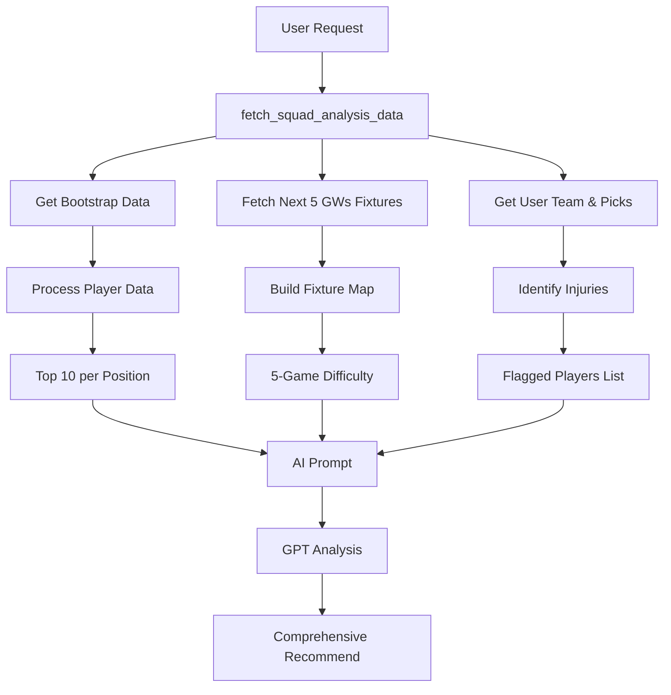

# FPL AI Assistant 🏆

Intelligent FPL manager tool using **GPT-5** for optimal squads, transfers & insights. Automatically tracks injuries, analyzes fixture difficulty over 5 gameweeks, and provides specific, actionable transfer recommendations.

[](https://fantasy-ai.streamlit.app)

- **Rank-Aware Strategy** - Adjusts posture (Defensive/Balanced/Aggressive) based on your overall rank
- **Strict Flop & Rising Star Detection** - Uses specific mathematical thresholds (recent points vs. xGI) to flag immediate sells and "must-buys"
- **Hit Authorization & Recovery Formula** - Calculates EV delta to justify -4, -8, or even -12 hits for explosive returns
- **Smart Calendar Double Gameweek Alerts** - Detects double headers across calendar weeks, even when FPL Gameweek IDs differ
- **Universal Chip Reset Logic** - Automatically unlocks all chips for the second half of the season (GW20+)
- **Captaincy Simulation** - Simulates optimal captaincy paths for the next 3 gameweeks
- **Dynamic Formation Selection** - Optimizes XI based on Clean Sheet probability vs. Attacking Return probability, not just a fixed 3-4-3
- **Streamlit UI** (sidebar settings, model selection, download MD)

## 🧠 How It Works

### Injury Tracking

- Automatically detects injured, doubtful, and unavailable players in your squad
- Provides status codes (available, doubtful, injured, unavailable, suspended)
- Shows chance of playing percentages and latest injury news
- Assigns urgency levels: Critical, High, Medium, Low

### Fixture Analysis

- Fetches and analyzes the **next 5 gameweeks** of fixtures
- Calculates difficulty ratings for each opponent (1=easiest, 5=hardest)
- Considers home/away advantage in recommendations
- Prioritizes players with favorable fixture runs

### Transfer & Hit Discipline

The AI follows a strict decision engine:

1. **Hit Recovery Formula**: Authorizes hits ONLY if `(Cost of Hit) / EV_Delta <= 2.0`.
2. **Flop Detection**: Sells players with < 6 pts in last 3 GWs (unless xGI is high).
3. **Rising Star Recognition**: Prioritizes players with > 18 pts in last 3 GWs or elite `xGI90`.
4. **Rank posture**:
   - < 50k: **Defensive** (Block EO)
   - 50k-500k: **Balanced**
   - > 500k: **Aggressive** (Seek Differentials)
5. **Price Trend Rules**: Checks `price_trend` to bank value or wait for updates.

### Replacement Suggestions

For each position (GK, DEF, MID, FWD), the AI provides:

- Top 10 players ranked by form
- Specific alternatives for injured/underperforming players
- Price comparisons and budget impact
- Fixture difficulty analysis for each option

## Data Flow



## Status Code Reference

| Code | Meaning      | Action            |
| ---- | ------------ | ----------------- |
| `a`  | Available    | No concern        |
| `d`  | Doubtful     | Monitor closely   |
| `i`  | Injured      | Consider transfer |
| `u`  | Unavailable  | Must transfer     |
| `s`  | Suspended    | Must transfer     |
| `n`  | Not in squad | Must transfer     |

## 🚀 Quick Start (Local)

1. **Clone**

```
git clone https://github.com/k1lgor/fantasy-ai.git
cd fantasy-ai
```

2. **Install (uv recommended)**

```
uv venv
uv pip install -r requirements.txt
```

3. **API Key**

```
cp .env.example .env
# Add OPENAI_API_KEY=sk-...
```

4. **Run**

```
uv run streamlit run app.py
```

5. **Use**

- Team ID: **6589598** (default)
- Generate → Copy recs

## ☁️ Deploy to Streamlit Cloud

1. Push to **GitHub** (all files)
2. [share.streamlit.io](https://share.streamlit.io) → New app → GitHub repo
3. **Settings** → Advanced → Secrets:

```
OPENAI_API_KEY = sk-your-key
```

4. App live! Share URL.

## 📱 UI

- Sidebar: Team ID, GPT model selection (`gpt-5.2`, `gpt-5.1`)
- Generate button → Markdown recs + download button

## 🔧 Files

- [`app.py`](app.py) - Streamlit UI & Orchestration
- [`fpl_data.py`](fpl_data.py) - FPL API data fetching & preprocessing
- [`analyzer.py`](analyzer.py) - Core AI logic, prompt engineering, and metric calculation
- [`requirements.txt`](requirements.txt) - Dependency list

## 🛠 Customize

- Prompts & Thresholds: `analyzer.py`
- Data Fetching: `fpl_data.py`
- UI Components: `app.py`

## ⚠️ Limits

- OpenAI costs (~$0.01/use)
- FPL API rate limits
- AI suggestions, verify!

## Example Output

See [DEMO.md](DEMO.md)
